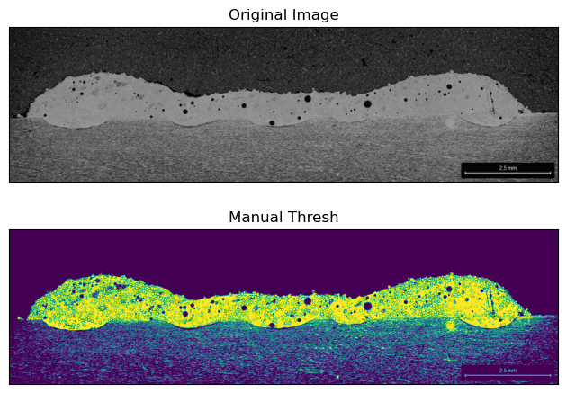
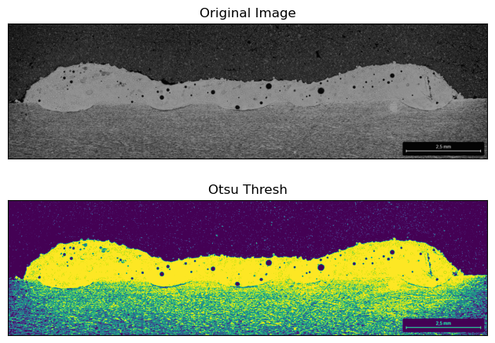
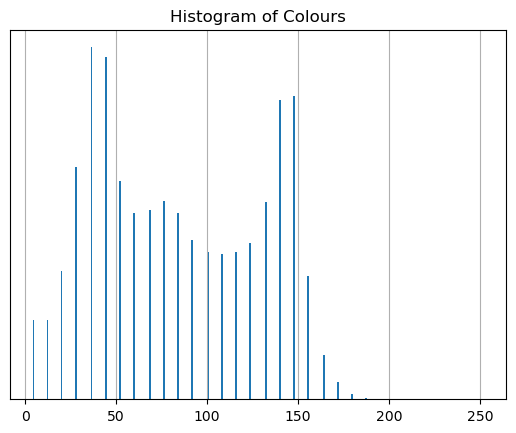

# To Nima: #

- The purpose of this code is to take in a folder of images that all contain 1 sample per image. The code needs to detect the "surface" of the image. The porosity of the sample is calculated by getting the area of the pores over the area of the sample, considering only the portion that is above the surface. Make sure your program does not detect the stains & particles.

- the image below is an example of what we want: 


```python
import cv2 as cv 
import matplotlib.pyplot as plt
import numpy as np

img = cv.imread('summary_16920_P1_1_2,5x_Overlay001.tif')
plt.imshow(img), plt.yticks([]), plt.xticks([])
plt.show()
```


    

    


- In the future, Vurgun wants to be able to detect the area of the sample that "spills" over the surface as well as the average height of the sample. See this link for more: https://github.com/dawn0125/AreaScript/issues

- The document below is about some of the functions and concepts used in the program. This is for your reference (and Vurgun's) if you need it. 

## Surface Detection ## 
- Surface detection is done by first blurring the image and then thresholding the image and then going along the first and last columns and picking out the first white pixel. The two pixels are connected with a line $y = mx + b$. Anything under the line is considered a surface. 

### Morphological Operations ###
- morphological operations are ways to process digital images based on their shapes, it is used in AreaScript.py to blur the image
- opencv has a function cv.morphologicalEx() performs morphological operations assuming the foreground object is white and the background is black
- cv.morphologicalEx() main operations:  

    - erosion: makes object skinnier 
    - dilation: makes object fatter 
    - opening: erosion followed by dilation, good to remove "noise" 
    - closing: dilation followed by erosion, good to close small holes inside foreground objects
    
- for more information, check this link: https://docs.opencv.org/4.x/d9/d61/tutorial_py_morphological_ops.html

### Thresholding ###

- thresholding turns your image into black and white
- opencv has a function cv.threshold to make thresholding an image easy
- when doing this manually, you must choose values for the upper and lower bound between 0 and 255

    - 0 is black and 255 is white


```python
img = cv.imread('16920_P1_1_2,5x_Overlay001.tif')

# define bounds
lower_bound = 127
upper_bound = 255

# convert image to grayscale
gray = cv.cvtColor(img, cv.COLOR_BGR2GRAY)

# thresh using defined bounds
ret, thresh = cv.threshold(gray, lower_bound, upper_bound, cv.THRESH_BINARY)

# plot
plt.subplot(211), plt.imshow(img)
plt.title('Original Image'), plt.xticks([]), plt.yticks([])
plt.subplot(212), plt.imshow(thresh)
plt.title('Manual Thresh'), plt.xticks([]), plt.yticks([])
plt.tight_layout()
plt.show()
```


    

    


- Otsu thresholding is when opencv chooses the upper and lower bounds for you based on a histogram of the colour distribution of the image


```python
# convert image to grayscale 
gray = cv.cvtColor(img, cv.COLOR_BGR2GRAY)

# otsu threshing
ret_otsu, thresh_otsu = cv.threshold(gray, 0, 255, cv.THRESH_BINARY + cv.THRESH_OTSU)

# plot
plt.subplot(211), plt.imshow(img)
plt.title('Original Image'), plt.xticks([]), plt.yticks([])
plt.subplot(212), plt.imshow(thresh_otsu)
plt.title('Otsu Thresh'), plt.xticks([]), plt.yticks([])
plt.tight_layout()
plt.show()

plt.hist(img.ravel(),256)
plt.title('Histogram of Colours'), plt.yticks([])
plt.grid()
plt.show()
```


    

    


    

    


### Masks ###
- A mask is an binary array that is the same shape as your image. It lets your program know which part of the image to analyze. In AreaScript.py, there are two masks that are combined to make your final mask:

 1. Surface mask. This is found by the procedure above. Anything above the line $y = mx + b$ is 1 (or 255), and anything below is 0 
 2. Threshold image
 
 - The masks are combined with cv.bitwise_and(). This function compares the two masks. For each pixel, if the pixel is white for both masks, the final mask has a white pixel. If the pixel is black for both masks, the final mask has a black pixel. However, if one pixel is white and one pixel is black, then the final pixel is still black. 

## Porosity ##
The program mainly uses opencv, an image processing library in python. Here is a link to get you started if you don't know how to use it: https://opencv.org/. The important functions that are used are shown below.

### Contours: ###
- Opencv has a function (cv.findContours) which is our best friend for this project. How is works it that when you feed it a black and white image, it draws out the borders between the black and white parts. From these "contours" you can find a lot of information using the rest of the pre-written functions by opencv, including:

    - area
    - perimeter
    - bounding rectangle 
    - center of mass 
    - "hierarchy" 

- we extract the sample based on area, it is the largest contour. We then use the area of the pores to find porosity: 

$$ porosity = \frac{area_{pores}}{area_{body}} $$

### Hierarchies: ### 
- cv.findContours outputs 2 arrays when you feed it an image. The first is an array of **contours**, curves joining continuous points. The second is an array of **hierarchies**. There is 1 hierarchy per contour, they are matched by the index (contour 1 has hierarchy 1). 
- The hierarchy consists of 4 pieces of information: [next, previous,child, parent]. The last two are the ones that we are interested in. The "parent" of a contour of the contour that encloses our contour of interest. The child is the contour that is inside our contour. 


- for example, in the code above,4 is a child of 3a, but 3a is a child of 3 
- in AreaScript.py, the pores checked to make sure their "parent" is the sample extracted
